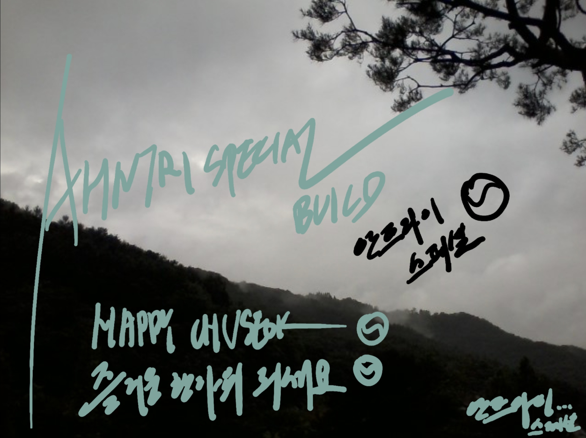

# Korean Thanksgiving Day 2021
즐거운 연휴 되세요!
내일은 추석입니다. 한국의 추수감사절이기도 합니다.
성묘 및 송편 등 여러가지 문화가 있습니다.
우리 전통을 위해 추석 에디션 빌드를 올립니다.
추석버전은 달색깔 및 추석밤하늘 색깔로 장식했습니다.
또한 아스키 아트로 추석 즐거운연휴되세요를 스타트스크린에 놔두었습니다.
감사합니다.
9/20/2021, 안지환 올림.
Tomorrow is Chuseok. It's Korean thanksgiving.
Korea has various cultures like visiting ancestor's graves and making/eating songpheon.
I made this version to keep the culture of Korea.
The version was decorated in the colors of the moon on chuseok and the sky of it.
I also did the startscreen with korean alphabet.
Thanks, 
9/20/2021, Jihwan Ahn.

9/22~23->Archived.
